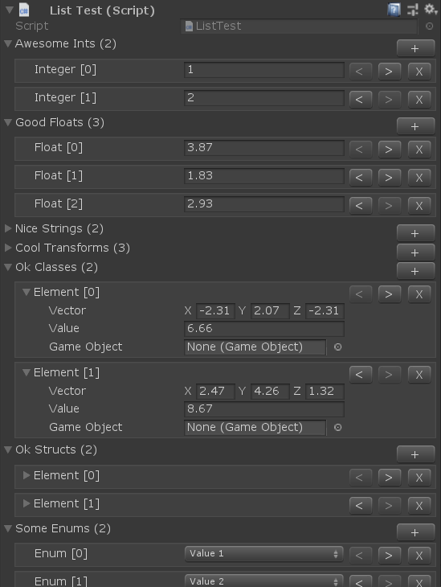

# Unity-List-Property-Drawer

A simple solution meant to improve Unity array/list editor UI. Works out of the box and supports add/remove and reorder of the array/list elements.

Doesn't support nested arrays/lists (yet).

```
    public class ListTest : MonoBehaviour
    {
        public int[] AwesomeInts;
        public float[] GoodFloats;
        public List<string> NiceStrings;
        public List<Transform> CoolTransforms;
        public List<TestClass> OkClasses;
        public List<TestStruct> OkStructs;
        public List<SomeType> SomeEnums;
        public Vector3[] FancyVectors;
        public bool[] ExcitingBools;
    }
```


